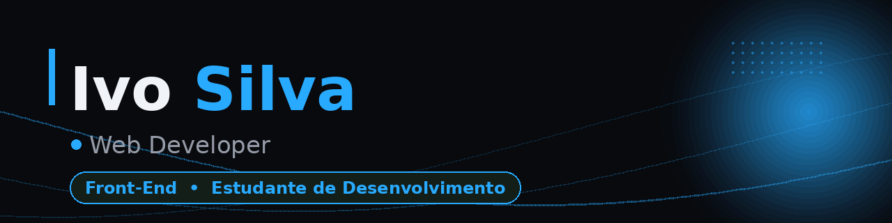

  

<h1 align="center">Ivo Silva</h1>

  <strong>Software Engineer</strong>

  

  
  
  

---

## 🚀 Aprendendo Atualmente

- HTML & CSS
- JavaScript
- Lógica de Programação
- React
- Node.js
- Versionamento com Git

---

## ⚡ Tech Stack

  

---

## 📊 GitHub Stats

  

